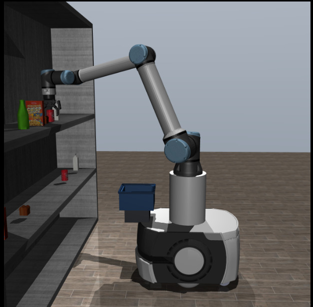
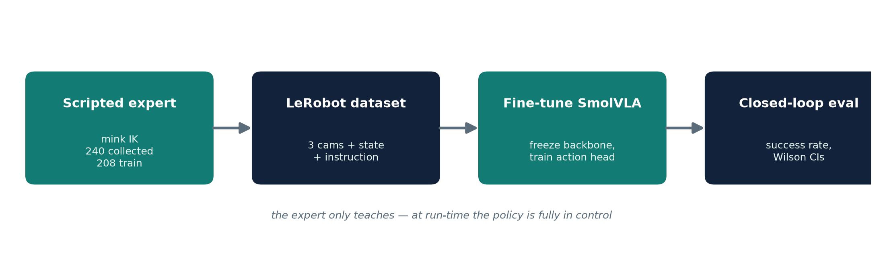
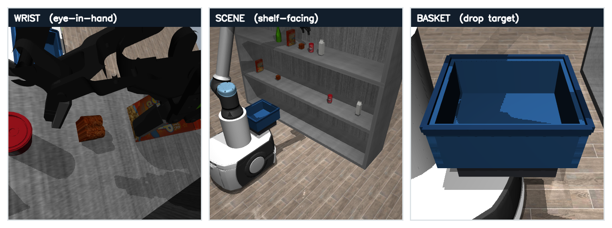
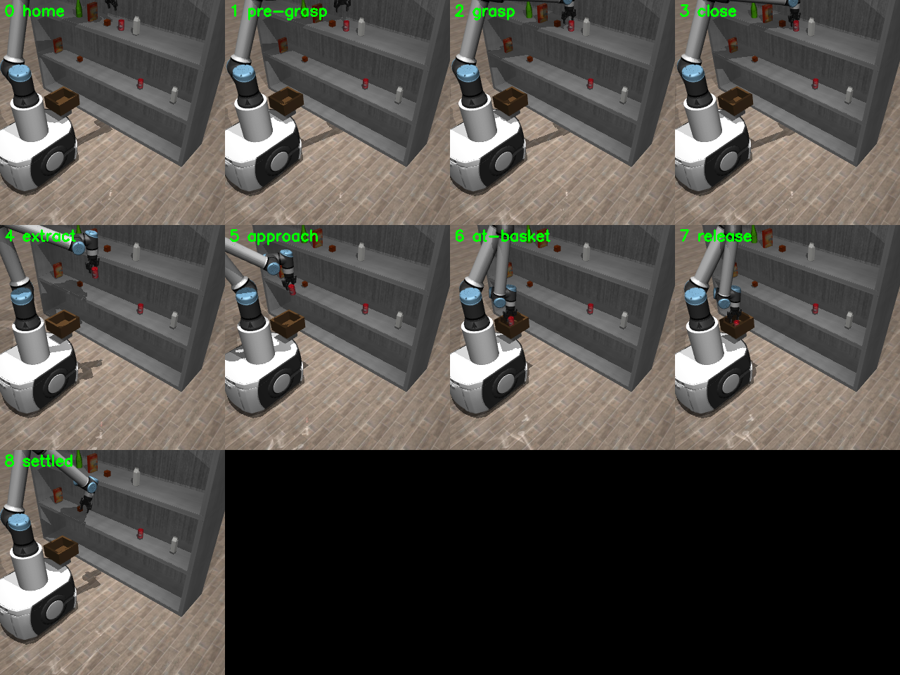
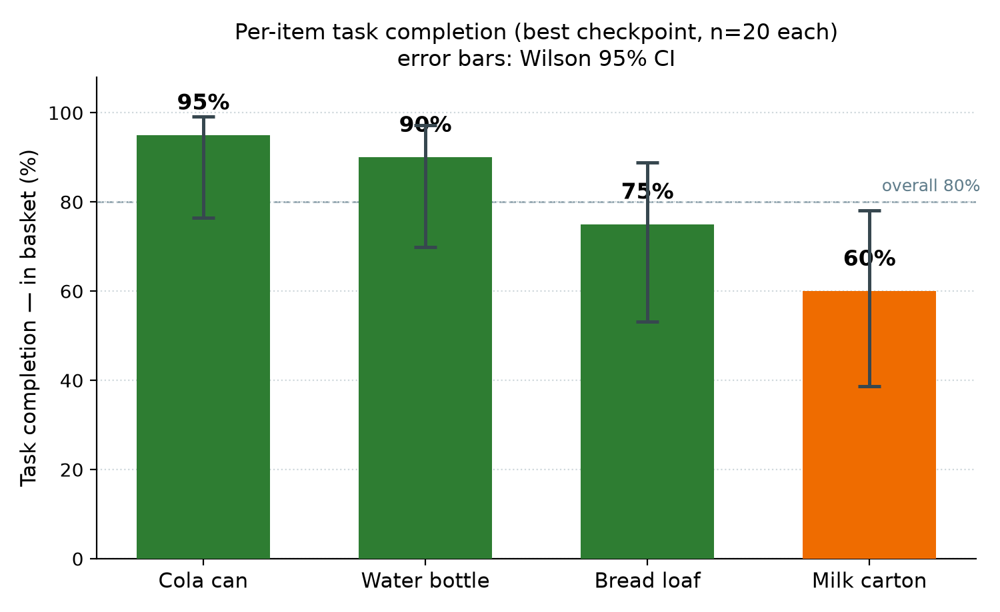
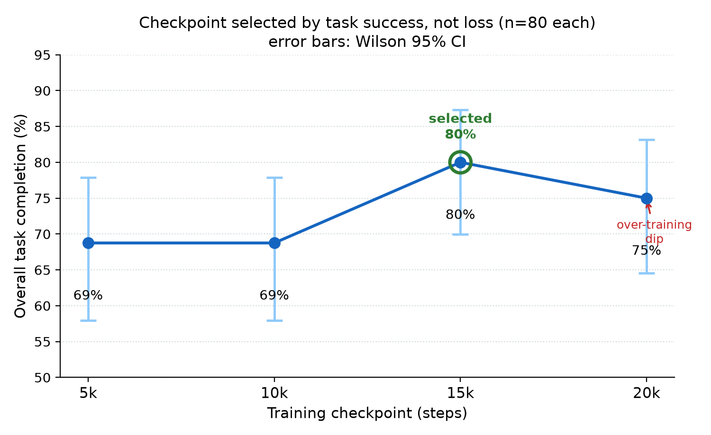

# Supermarket VLA — language-conditioned pick-and-place with a fine-tuned SmolVLA

MSc Robotics thesis project (Cranfield University, 2026): *Mobile Manipulator Grasping
of Everyday Objects Using Vision–Language–Action Models*.

A UR10e arm with a Robotiq 2F-85 gripper, mounted on an Omron LD-60 mobile base in a
MuJoCo supermarket scene, is told *"pick up the milk and place it in the basket"* and
does it — driven by **SmolVLA**, a vision-language-action model fine-tuned on a single
12 GB GPU by freezing its pretrained vision-language backbone and training only the
action expert.



The policy sees only pixels and joint states — three 96 × 96 RGB cameras (wrist,
shelf-facing scene, basket), the 7-D arm state and the text instruction. No object
coordinates or segmentation are given to it.

---

## Results at a glance

| Test (SmolVLA, 15k-step checkpoint) | Task completion | Grasp |
|---|---|---|
| Fixed object positions (thesis headline, 4 items × 20 trials) | **80.0 %** (95 % CI 70–87) | 92.5 % |
| Same, re-run with per-trial logging | 81.2 % (CI 71–88) | 91.2 % |
| Objects jittered ±2.5 cm — the same noise as in the training data | **58.8 %** (CI 48–69) | 80.0 % |
| Items moved to positions not seen in training | **0 / 216** reached the actual item | — |

| Baseline / extension | Result |
|---|---|
| ACT trained on all four items | 25.0 % (fixed), 13.8 % (jittered) |
| ACT trained on one item (bread) | 100 % (fixed), 85 % (jittered) |
| Shopping lists via a scripted orchestrator | 9 / 20 two-item and 6 / 20 three-item lists completed |

All numbers are closed-loop rollouts with Wilson 95 % confidence intervals; the raw
per-trial logs are in [`outputs/review/`](outputs/review).

## Key finding: the policy learned a shortcut, not visual grounding

The language conditioning works — change only the instruction and the arm goes for
the named item — but it works by **recall**, not by finding the item in the image.
When items were moved to new positions (swapped, or shifted along the shelf), the arm
went to where the named item **had been in training** in all 216 trials, and to where
it actually was in none. The drop from 80 % to 58.8 % under ±2.5 cm jitter is the
same effect at a smaller scale.

The cause is in the data: every item always sat in the **same shelf slot**, so the
instruction alone predicted the reach target and the policy never needed the camera
to choose where to go. With the vision-language backbone frozen and only 208
demonstrations, the action expert learned that shortcut.

A follow-up is in progress to test this directly: re-collect the demonstrations with
items randomly assigned to shelf slots, raise the image resolution, compare a frozen
and a vision-unfrozen backbone, and re-run the same three tests.

The ACT baselines frame the result: a single-task ACT policy is reliable, but ACT
trained on all four items collapses to 25 %, while SmolVLA reaches 80 % on the same
data — the pretrained backbone is what makes the multi-item, language-conditioned
policy work at this data scale, even though it does not yet ground in the image.

---

## Method



1. **Scene** (`envs/supermarket_env.py`) — UR10e and Robotiq 2F-85 from MuJoCo
   Menagerie on robosuite's Omron LD-60 base, a stocked shelf of robosuite's textured
   grocery meshes, and a tote on the base deck.
2. **Scripted expert** (`scripts/scripted_expert.py`, `scripts/find_grasp.py`) —
   top-down grasp via [mink](https://github.com/kevinzakka/mink) inverse kinematics,
   frontal extraction from the shelf bay, carry, place. 96–100 % success per item
   under the ±2.5 cm jitter. The cereal box is excluded: its wide smooth face slips in
   the two-finger gripper.
3. **Demonstrations** (`scripts/collect_data.py`, `scripts/convert_to_lerobot.py`) —
   240 successful episodes (208 train / 32 validation) at ~20 Hz, each with a
   paraphrased instruction (6 templates per item), saved as a LeRobot dataset.
4. **Fine-tuning** — SmolVLA from `lerobot/smolvla_base`, backbone frozen, action
   expert trained: batch 8, 20k steps, ~4 h and ~3 GB of GPU memory.
5. **Evaluation** (`scripts/rollout.py`, `scripts/eval_checkpoints.py`) — closed-loop
   rollouts, ≥ 20 trials per item, checkpoints chosen by task success rather than loss.





### From 0 % to 80 % placement

The first policy grasped 75 % of the time but placed 0 %: it carried the item to
within ~2 cm of the basket and released it ~10 cm short. Three changes fixed it —
ending each demonstration cleanly at "placed", adding a dedicated basket camera (the
drop target was barely visible before), and widening the tote.

### Per-item and checkpoint results





The four checkpoints are not statistically distinguishable on placement (McNemar
exact test, all p ≥ 0.19), so 15k is a deployment choice rather than a significant
optimum.

---

## Reproducing

The trained checkpoints and the dataset from the thesis were not kept, so the
pipeline below regenerates them from scratch.

```bash
pip install -r requirements.txt
# MuJoCo Menagerie is downloaded automatically on first use via robot_descriptions,
# or set MUJOCO_MENAGERIE_DIR to an existing checkout.

python scripts/verify_scene.py                         # build the scene, save check images
python scripts/scripted_expert.py --product cola_can   # one scripted pick-and-place
python scripts/collect_data.py --n 60                  # 60 successful demos per item
python scripts/convert_to_lerobot.py                   # -> LeRobot dataset in data/

python -m lerobot.scripts.lerobot_train \
    --dataset.repo_id=local/supermarket_manip \
    --dataset.root=data/supermarket_manip_lerobot \
    --policy.type=smolvla --policy.pretrained_path=lerobot/smolvla_base \
    --policy.push_to_hub=false --output_dir=outputs/train/smolvla_supermarket_v2 \
    --batch_size=8 --steps=20000 --save_freq=5000 --eval_freq=0 --wandb.enable=false

CKPT=outputs/train/smolvla_supermarket_v2/checkpoints/015000/pretrained_model
python scripts/eval_checkpoints.py --run outputs/train/smolvla_supermarket_v2
python scripts/rollout.py --checkpoint $CKPT --view       # watch it
python scripts/exp3_grounding.py --checkpoint $CKPT --mode all   # displacement test
```

On a headless Linux machine set `MUJOCO_GL=egl` for offscreen rendering; leave it unset
for the interactive viewer (`--view`).

## Repository layout

```
envs/supermarket_env.py    MuJoCo scene (robot, base, shelf, products, cameras)
scripts/                   scripted expert, data collection, training, evaluation,
                           review experiments (exp*.py) and figure generation (make_*.py)
shared/                    instruction templates
outputs/review/            per-trial logs of the evaluation and review experiments
thesis/                    the thesis LaTeX source (Cranfield template; compile with
                           pdfLaTeX + biber, e.g. on Overleaf)
```

## Limitations and future work

- **Simulation only**, and the reported 80 % holds at fixed object positions — see the
  key finding above.
- **Navigation is not implemented.** The original plan was a two-model system — this
  manipulation policy plus a navigation VLA and an orchestrator for a store with
  moving shoppers. Only the manipulation half was built; the base stays parked.
- **Four items.** The cereal box was dropped because the rigid two-finger gripper
  cannot hold its smooth wide face.

## Licence

Code: MIT (see [LICENSE](LICENSE)). Third-party assets loaded at run time — MuJoCo
Menagerie models, robosuite meshes and the SmolVLA weights — keep their own licences.
